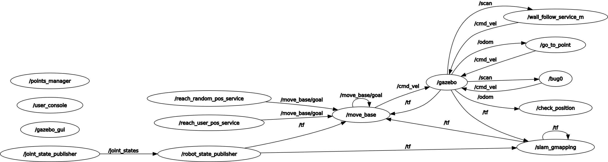

# README - RT1 - Assignment 2 - Final Assignment

**Francesco Ganci - 4143910** - Robotics Engineering - A.A. 2020/2021

> Take a look at the video demo of the project!
> - [video demo here](https://drive.google.com/file/d/1AQQ51eeMmpt2FT_Vw5nCcbXFsyMsiSpH/view?usp=sharing)
> 
> Doxygen Documentation: 
> - [Doxygen Documentation here]()

# How to set up the project

Here are the instructions for setting up the project. 

## Compatibility

The project is compatible with **ROS Noetic**. Not yet tested with *ROS kinetic*: probably, it doesn't work there.

## Dependencies

### Slam - GMapping

In order to run the project, you need the two packages you can find [here](https://github.com/CarmineD8/slam_gmapping.git). SLAM and GMapping are tools for managing the movement of a robot with noisy odometry: their purpose is to correct odometry in a way that the robot can get its position as precisely as possible. 

Copy the packages into the workspace you prefer. **use branch : _noetic_**

- [GitHub : SLAM-GMapping Packages](https://github.com/CarmineD8/slam_gmapping.git)

Also these packages are required. Please install them. 

```bash
sudo apt-get install ros-noetic-openslam-gmapping
sudo apt-get install ros-noetic-navigation
```

### MoveBase

MoveBase is a motion planner: given a goal, it can retrieve a path from the actual position to the desired one, recomputing the path depending on the informations gathered by sensors in conjunction with Slam-GMapping. 

Simply install it:

```bash
sudo apt-get install ros-noetic-move-base
```

### Robot Description

In the repository [here](https://github.com/CarmineD8/robot_description) you can find a package which contains the data for simulating a robot with disturbed odometry. This package is needed in order to run the simulation in Rviz and Gazebo. 

Copy the packages inside the workspace you prefer. **use branch : _noetic_**

- [GitHub : Robot Description](https://github.com/CarmineD8/robot_description)

## Setup

1. I suggest you to create a new empty workspace in which install the project. Create the new workspace, and then copy the dependencies inside it. 

2. Download the repository, then add in your *src* folder the package *final_assignment*

3. Go to the root of the workspace, and from there launch `catkin_make`

4. Restart the console. That's all! 


# How to run the project

Inside the package, in the folder *launch*, you can find several launch files. Because of the huge quantity of nodes you have to launch for running the project, i strongly suggest to launch everything from these files. 

First of all, launch the simulation environment. You can ignore the large amount of warnings on the console: if Gazebo and Rviz run well, you need nothing else. Otherwise, close everything and relaunch. 

```bash
roslaunch final_assignment start.launch
```

Done this, launch another terminal and type this:

```bash
roslaunch final_assignment final_assignment.launch
```

This will launch the command line interface and all the other components. See the documentation, section *services*, for further informations about these components. Remember that you can interact with them via `rosservice call` if you note something strange during the simulation. 

At this point, you can start typing commands. See the documentation, section *Command Line Interface*, for further infos about the commands. If you don't want to bother in reading documentation, simply type `help` and start playing with it. Have fun!

# Structure of the project

## Package File System

The package *final_assignment* contains:

- **config** : it contains only one file, the simulation settings for Rviz
- **launch** : launch files for the project.
- **param** : YAML parameters files used for launching the simulation environment
- **scripts** : it contains all the scripts of this project
- **srv** : custom services. See the documentation, section *services*
- **urdf** : description of a robot with noisy odometry
- **worlds** : the description of the environment in which the robot moves

## Architecture of the project

The project needs the nodes you can find in the [final_assignment.launch](https://github.com/programmatoroSeduto/RT1_assignment_2/blob/main/final_assignment/launch/final_assignment.launch) launch file. Note the structure of this file, splitted in mainly two parts: start of the services, and then start of the command line interface. 

### wall_follow_service_m.py (original version)

This node implements the wall_follow behaviour. 

```xml
<node pkg="final_assignment" name="wall_follow_service_m" type="wall_follow_service_m.py" required="true" />
```

Services exposed:

- */wall_follower_switch* : turn on and off the service. 

Topics: 

- (publisher) */cmd_vel* : the node can perform a low-level control of the robot, sending it twists. 
- (subscriber) */scan* : the robot has some laser sensor which uses in controlling the motion. 

Parameter Server:

- (read only) *des_pos_x* : x coordinate of the target
- (read only) *des_pos_y* : y coordinate of the target

### go_to_point_service_m.py (original version)

A "go-to-point" behaviour is realized here: the robot moves straight towards the point, choosing a proper twist. It cannot deal with obstacles. 

```xml
<node pkg="final_assignment" name="go_to_point" type="go_to_point_service_m.py" required="true" />
```

Services exposed:

- */go_to_point_switch* : turn on and off the service. 

Topics:

- (publisher) */cmd_vel* : the node can perform a low-level control of the robot.
- (subscriber) */odom* : the calculation of the next twist to send requires the distance from the point the robot has to reach. 

Parameter Server:

- (read only) *des_pos_x* : x coordinate of the target
- (read only) *des_pos_y* : y coordinate of the target

### check_position.py

This node provides some useful functionalities for understanding the progress of the motion towards the goal. Moreover, it helps in easily detecting the position of the robot in the environment. 
It implements in one place oe functionality that is of use of many nodes in the project. 

```xml
<node pkg="final_assignment" name="check_position" type="check_position.py" required="true" output="screen" />
```

Services exposed (see *services* documentation):

- */check_position* : extract useful informations about */odom* topic; compute the distance between one position and the goal

Topics:

- */odom* : the node periodically checks the actual position of the robot. 

### points_manager.py

This simple node contains the allowed positions for the robot. It can choose one among them, and check if a given position is contained in the set. 

```xml
<node pkg="final_assignment" name="points_manager" type="points_manager.py" required="true" output="screen" />
```

Services exposed (see *services* documentation):

- */get_point* : choose one position among all, then return it. Empty request. 
- */position_defined* : check if a position is allowed or not. 

### reach_random_pos_service.py

It implements a background task. The node ciclically asks the service */get_point* for a target, then reaches it using the *move_base* motion planning algorithm. This node can be turned on and off. I strongly suggest you to read the documentation about it, in order to better understand how it is designed and why in that way. See both *reach_random_pos_service.py* and *user_console.py*.

```xml
<node pkg="final_assignment" name="reach_random_pos_service" type="reach_random_pos_service.py" required="true" output="screen" />
```

Services exposed (see *services* documentation):

- */reach_random_pos_status* : status of the node, and other useful information about positioning of the robot in the environment. 
- */reach_random_pos_switch* : turn on and off the node. 

Services used: 

- */check_position* : check the progress towards the goal
- */get_point* : choose a random target before begin the movement

Topics:

- (Publisher) */move_base/goal* : set the goal to MoveBase

### reach_user_pos_service.py

It implements a blocking service. The node takes one target from the request, then sends it to bug0 and tries and reach it using the *move_base* motion planning algorithm.

```xml
<node pkg="final_assignment" name="reach_user_pos_service" type="reach_user_pos_service.py" required="true" output="screen" />
```

Services exposed (see *services* documentation):

- */user_target* : send a target to this node

Topics:

- (Publisher) */move_base/goal* : set the goal to MoveBase

### bug0.py (service version)

This node, based on the version kindly provided by prof. *Carmine Recchiuto*, implements a motion planning algorithm alternative to move_base. This node uses the two services go_to_point_service_m.py and wall_follow_service_m.py in order to reach the goal, as in a blind search. 

```xml
<node pkg="final_assignment" name="bug0" type="bug0.py" required="true" />
```

Services exposed (see *services* documentation). Note that bug0.py and reach_random_pos_service.py provide a similar interface. 

- */bug0_switch* : the service can be turned on and off. 
- */bug0_status* : status of the node.

Services used: 

- */get_point* : choose a random target before begin the movement
- */wall_follower_switch* : start and stop following walls
- */go_to_point_switch* : start and stop going straight to the target

Topics:

- (subscriber) */scan* : used for alternating wall_follow with go_to_point
- (subscriber) */odom* : get the actual position of the robot
- (publisher) */cmd_vel* : used only for stopping the robot in one position

Parameter Server:

- (read/write) *des_pos_x* : x coordinate of the target
- (read/write) *des_pos_y* : y coordinate of the target

### user_console.py

It implements a command line interface. See documentation, section *s*, for further information about how to use it. 

```xml
<node pkg="final_assignment" name="user_console" type="user_console.py" output="screen" required="true" />
```

Services in use:

- */wall_follower_switch*: functionalities 3 and 4
- */reach_random_pos_switch*: functionalities 1 and 4 using move_base as motion planning algorithm
- */user_target* : functionality 2 using move_base as motion planning algorithm
- */position_defined* : functionalities 1 and 2
- */bug0_switch* : functionalities 1, 2 and 4 when using bug0 as motion planning algorithm
- */bug0_status* : functionality 2 using bug0 as motion planning algorithm

### RosGraph

Here is the rosgraph of the project:

